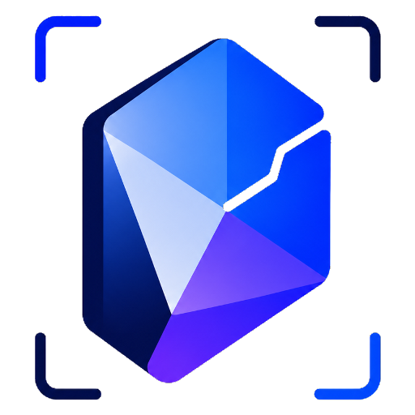

<div align="center">



# SnapMind · 瞬念

**Capture your thoughts from anywhere.**

截图式第二大脑 —— 按下快捷键，框选屏幕，写下想法，AI 把它整理成结构化 Markdown，直接写进你的 Obsidian 知识库。

[](./LICENSE)
[](#-双端实现)


</div>

---

## ✨ 一次快捷键，完成一次捕捉

在任意界面看到有价值的信息时：

```
⌃⇧1  →  框选区域  →  写下「我的想法」  →  保存
                                          └─→ AI 识别 + 整理 → Obsidian 笔记
```

1. 按全局快捷键（Windows `Ctrl+Shift+1` / macOS `⌃⇧1`）
2. 框选一块屏幕区域
3. 弹出批注浮窗，写下你此刻的想法
4. 点保存 —— 后台 AI 多模态识别截图，自动生成**标题 / 摘要 / 标签 / OCR 原文**，连同你的想法整理成一篇 Markdown 写入本地 **Obsidian Vault**，并留一份本地历史。

> 把「看到 → 截图 → 思考」这条最高频的捕捉动作，压缩成一次快捷键。

## 🚀 功能

| | |
|---|---|
| ⌨️ **全局快捷键** | 任意程序触发截图 + 区域框选 |
| ✍️ **批注浮窗** | 截图后即写「我的想法」，⌘/Ctrl+⏎ 保存 |
| 🤖 **AI 多模态** | 标题 + 摘要 + 标签 + OCR，默认 **MiniMax**（OpenAI 兼容，可自由切换） |
| 🛟 **绝不丢笔记** | AI 失败 / 断网 / Key 失效自动降级，照常保存 |
| 📝 **Obsidian 写入** | YAML frontmatter + 纯内容，**不嵌截图** |
| 🧭 **来源信息** | 自动记录来源应用、窗口标题、**网页 URL** |
| 🖼️ **截图备份** | 可选目录 + 保留时长（默认 7 天到期自动清理） |
| 🗂️ **本地历史** | 列表回看，一键用 Obsidian 打开、可删 |
| 🪟 **常驻后台** | 系统托盘 / 菜单栏常驻、关窗不退出、开机自启 |

## 🖥️ 双端实现

同一套产品理念、同一套 AI 与 Markdown 规格，两端各用**最贴合平台的原生方式**实现 —— 都是本地优先、AI 直连云端、**无后端**。

| | **Windows** · [`apps/desktop`](./apps/desktop) | **macOS** · [`apps/macos`](./apps/macos) |
|---|---|---|
| 技术栈 | Flutter + Dart · Fluent UI · Riverpod | 原生 SwiftUI · AppKit（零第三方依赖） |
| 区域截图 | 自绘无边框 overlay 框选（DPI 自适配） | 系统 `screencapture -i` 原生框选器 |
| 全局快捷键 | hotkey_manager | Carbon `RegisterEventHotKey` |
| 来源网页 URL | 浏览器扩展 + 本地回环服务（[`extension/`](./extension)） | Apple Events / AppleScript |
| 来源应用 | win32 FFI | NSWorkspace + CGWindowList |
| 历史存储 | SQLite（sqflite_ffi） | Codable JSON |
| 常驻 | 系统托盘（tray_manager） | 菜单栏 `NSStatusItem` |
| 状态 | ✅ v0.1 已发布 | ✅ v0.1 功能完整 |

> 长期覆盖 **Windows / macOS / Android**。架构与模块设计见 [docs/architecture.md](./docs/architecture.md)。

## 📦 仓库结构

```
snapmind/
├─ apps/
│  ├─ desktop/      # Windows 客户端（Flutter + Dart）
│  │  └─ lib/core/  # 纯 Dart 领域层：模型 / Markdown / Obsidian / AI
│  └─ macos/        # macOS 客户端（原生 SwiftUI，零 SwiftPM 依赖）
│     └─ Sources/   # AppKit 入口 + SwiftUI 视图 + Services
├─ extension/       # 浏览器扩展（Windows 端取网页来源 URL）
├─ brand/           # 品牌 LOGO 源图与图标产物
├─ docs/            # 架构、路线图
└─ platform/        # 平台相关脚手架
```

## ⚡ 快速开始

**Windows**（需 Flutter SDK + Visual Studio 2022「C++ 桌面开发」）

```bash
cd apps/desktop
flutter pub get
flutter run -d windows
```

**macOS**（需 Xcode；纯系统框架，无需 CocoaPods / SwiftPM）

```bash
cd apps/macos
./build.sh run        # swiftc 直编 + 组 .app + ad-hoc 签名并启动
./package.sh          # 出便携 zip → dist/
```

详细贡献流程见 [CONTRIBUTING.md](./CONTRIBUTING.md)。

## 🤖 AI 配置

应用内「设置」页填写即可（API Key 走系统安全存储 / 钥匙串，不落明文）：

- **Base URL** —— 默认 MiniMax，可改 OpenAI / DeepSeek / 通义 / 智谱 / 本地 Ollama 等任意 OpenAI 兼容端点
- **API Key**
- **Model** —— 必须是**多模态**模型（能读图）

## 🗺️ 路线图

`闭环（截图→批注→Markdown→Obsidian）→ AI 识别 → 来源信息 → 来源 URL → 历史 → 打磨打包`

完整里程碑见 [docs/roadmap.md](./docs/roadmap.md)。后续：Android 端 · 本地 OCR · 公证分发 · CI。

## 📄 许可证

[GPL-3.0](./LICENSE) © SnapMind contributors

<div align="center">
<sub>用一次快捷键，留住每一个瞬念。</sub>
</div>
